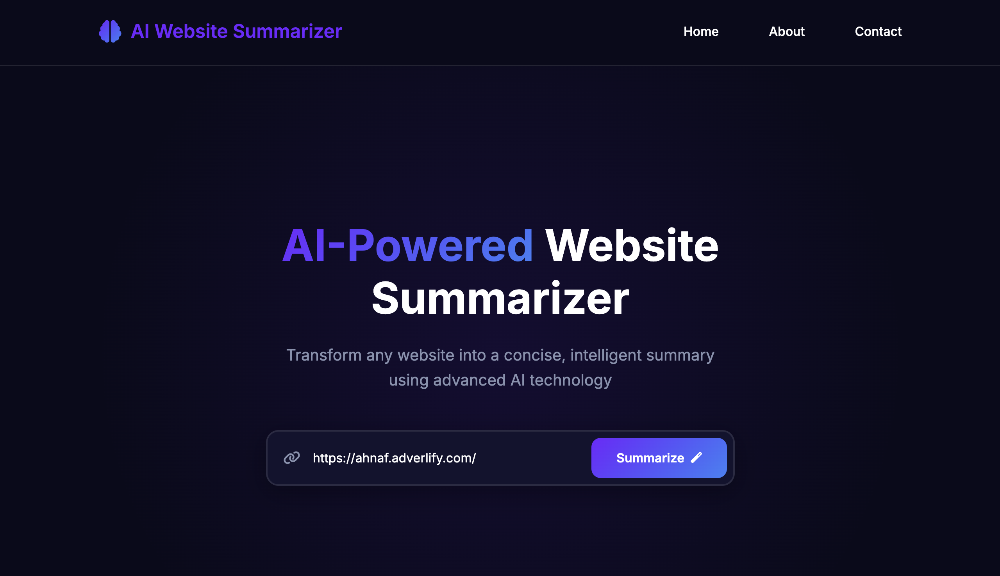

# Website Summarizer

A professional Python application that extracts content from websites and generates summaries using either OpenAI API or Ollama (local LLM). Features both a web interface and command-line usage.



## Features

- **Website Content Extraction**: Clean extraction of text content from websites
- **Multiple LLM Options**: Support for both OpenAI API and Ollama (local LLM)
- **Web Interface**: Beautiful Flask-based web application
- **Command Line Interface**: Simple CLI for quick summaries
- **Error Handling**: Robust error handling for network and API failures
- **Configuration Management**: Centralized configuration with environment variable support
- **Modular Design**: Clean separation of concerns with dedicated classes
- **Jupyter Support**: IPython display integration for formatted output

## Project Structure

```
ai_website_summary/
├── app.py              # Flask web application
├── main.py             # Command-line entry point
├── config.py           # Configuration management
├── website.py          # Website content extraction
├── summarizer.py       # LLM API integration and summarization
├── example.py          # Usage examples
├── requirements.txt    # Python dependencies
├── templates/          # Flask HTML templates
│   ├── index.html      # Main web interface
│   └── contact.html    # Contact page
├── static/             # Static assets for web interface
└── README.md           # Project documentation
```

## Installation

1. Clone the repository:
```bash
git clone <repository-url>
cd ai_website_summary
```

2. Install dependencies:
```bash
pip install -r requirements.txt
```

3. Set up environment variables:
```bash
# Create a .env file in the project root
touch .env
```

## Configuration

### Option 1: Using OpenAI API

Add the following to your `.env` file:

```bash
# OpenAI Configuration
OPENAI_API_KEY=your_openai_api_key_here
OPENAI_MODEL=gpt-3.5-turbo
OPENAI_API_BASE=https://api.openai.com/v1
USE_OPENAI=true
```

**How to get OpenAI API Key:**
1. Go to [OpenAI Platform](https://platform.openai.com/)
2. Sign up or log in to your account
3. Navigate to "API Keys" in the left sidebar
4. Click "Create new secret key"
5. Copy the key and paste it in your `.env` file

### Option 2: Using Ollama (Local LLM)

Add the following to your `.env` file:

```bash
# Ollama Configuration
OLLAMA_API_URL=http://localhost:11434/api/chat
OLLAMA_MODEL=llama3.2
USE_OPENAI=false
```

**How to set up Ollama:**
1. Install Ollama from [ollama.ai](https://ollama.ai/)
2. Pull a model (e.g., llama3.2):
   ```bash
   ollama pull llama3.2
   ```
3. Start Ollama service:
   ```bash
   ollama serve
   ```

## Usage

### Web Interface (Recommended)

1. Start the web application:
```bash
python app.py
```

2. Open your browser and go to: `http://localhost:8000`

3. Enter a website URL and click "Summarize" to get instant summaries.

### Command Line Usage

#### Basic Usage
```bash
python main.py
```

#### Run Examples
```bash
python example.py
```

### Python API Usage

#### Basic Usage with OpenAI
```python
from summarizer import WebsiteSummarizer

# Create summarizer instance (uses OpenAI by default if configured)
summarizer = WebsiteSummarizer()

# Summarize a website
summary = summarizer.summarize("https://example.com")
print(summary)
```

#### Basic Usage with Ollama
```python
from summarizer import WebsiteSummarizer

# Create summarizer instance for Ollama
summarizer = WebsiteSummarizer(use_openai=False)

# Summarize a website
summary = summarizer.summarize("https://example.com")
print(summary)
```

#### Advanced Usage with Custom Configuration
```python
from website import Website
from summarizer import WebsiteSummarizer

# Create website object
website = Website("https://example.com")

# Create summarizer with custom settings
summarizer = WebsiteSummarizer(
    api_url="http://localhost:11434/api/chat",  # Ollama
    model="llama3.2",
    use_openai=False
)

# Summarize using the website object
summary = summarizer.summarize_website_object(website)
print(summary)
```

#### OpenAI with Custom Configuration
```python
from summarizer import WebsiteSummarizer

# Create summarizer with OpenAI settings
summarizer = WebsiteSummarizer(
    api_url="https://api.openai.com/v1/chat/completions",
    model="gpt-4",
    use_openai=True
)

summary = summarizer.summarize("https://example.com")
print(summary)
```

#### Jupyter/IPython Display
```python
from summarizer import WebsiteSummarizer

# Create summarizer instance
summarizer = WebsiteSummarizer()

# Display summary in formatted markdown (Jupyter/IPython)
summarizer.display_summary("https://example.com")
```

## Environment Variables Reference

| Variable | Description | Default | Required |
|----------|-------------|---------|----------|
| `OPENAI_API_KEY` | Your OpenAI API key | None | Yes (for OpenAI) |
| `OPENAI_MODEL` | OpenAI model to use | `gpt-3.5-turbo` | No |
| `OPENAI_API_BASE` | OpenAI API base URL | `https://api.openai.com/v1` | No |
| `OLLAMA_API_URL` | Ollama API URL | `http://localhost:11434/api/chat` | No |
| `OLLAMA_MODEL` | Ollama model name | `llama3.2` | No |
| `USE_OPENAI` | Whether to use OpenAI (true/false) | `false` | No |

## Quick Start Guide

### For OpenAI Users:
1. Get your OpenAI API key from [platform.openai.com](https://platform.openai.com/)
2. Create `.env` file with your API key
3. Set `USE_OPENAI=true` in `.env`
4. Run `python app.py` for web interface or `python main.py` for CLI

### For Ollama Users:
1. Install Ollama from [ollama.ai](https://ollama.ai/)
2. Run `ollama pull llama3.2` to download a model
3. Start Ollama with `ollama serve`
4. Create `.env` file with `USE_OPENAI=false`
5. Run `python app.py` for web interface or `python main.py` for CLI

## Troubleshooting

### Common Issues

1. **"OPENAI_API_KEY is required" error**
   - Make sure you've added your OpenAI API key to the `.env` file
   - Ensure `USE_OPENAI=true` is set in your `.env` file

2. **Ollama connection error**
   - Make sure Ollama is running: `ollama serve`
   - Check if the model is downloaded: `ollama list`
   - Verify the API URL in your `.env` file

3. **Web interface not loading**
   - Check if Flask is installed: `pip install flask`
   - Ensure port 8000 is not in use
   - Try a different port by modifying `app.py`

4. **Website content extraction fails**
   - Some websites may block automated requests
   - Check if the URL is accessible in your browser
   - The application includes retry logic for common issues

### Debug Mode

To run the web application in debug mode:
```bash
export FLASK_ENV=development
python app.py
```

## API Endpoints

When running the web interface, the following API endpoints are available:

- `GET /` - Main web interface
- `POST /summarize` - API endpoint for summarizing websites
  - Request body: `{"url": "https://example.com"}`
  - Response: `{"success": true, "summary": "...", "url": "..."}`

## Contributing

1. Fork the repository
2. Create a feature branch
3. Make your changes
4. Add tests if applicable
5. Submit a pull request

## License

This project can be used for any personal purpose.

---

**Take Love from [Ahnaf Rahat](https://github.com/ahnafrahat)**
